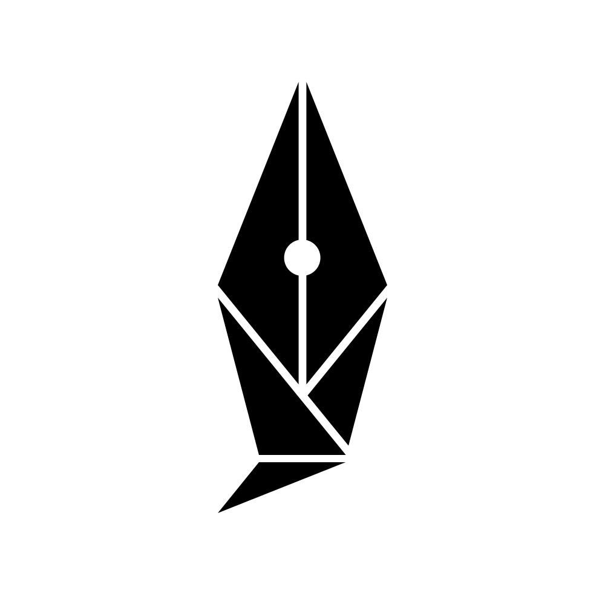

#  My Catatan Kuliah

A modern note-taking application with AI-powered features, real-time collaboration, and hybrid search capabilities.

## Features

- **AI-Powered**: Summarization, retrieval-augmented generation, and intelligent search.
- **Real-time Collaboration**: Collaborative editing powered by Yjs.
- **Hybrid Search**: Combining vector search with traditional text search.
- **S3 Storage**: Integrated object storage for files and attachments via MinIO.

## Architecture

The project is structured as a monorepo with the following main components:

- **`apps/backend`**: Go service handling API requests and core logic.
- **`apps/frontend`**: React application built with Vite and Tailwind CSS.
- **`ai/`**: Python service providing AI capabilities (Summarization, RAG).
- **`embedder/`**: Python worker for asynchronous document embedding processing.
- **`hocuspocus/`**: Node.js server for real-time collaborative editing.
- **`proto/`**: Shared Protobuf definitions.

## Getting Started

### Prerequisites

- [Docker](https://www.docker.com/)

### Option 1: Docker Compose (Quick Start)

Deploy the entire stack with a single command.

1. **Clone the repository**:
   ```bash
   git clone https://github.com/hilmoo/My-Catatan-Kuliah.git
   cd My-Catatan-Kuliah
   ```

2. **Configure Environment Variables**:
   
   Create a `.env` file in the root directory from the provided example:
   ```bash
   cp .env.example .env
   ```

3. **Start the Services**:
   ```bash
   docker compose up -d
   ```

The application will be accessible at `http://localhost:8080`.

### Option 2: Dev Container (for Development)

This project provides a fully configured development environment via VS Code Dev Containers.

1. Open the project folder in VS Code.
2. Click **"Reopen in Container"** when prompted.
3. The environment will automatically set up all dependencies.
4. Use `task` to start the development dashboard.

## Task Runner

This project uses Taskfile to simplify development workflows and common commands.

To see available tasks:

```
task --list
```

## Built by Kelompok Belut Ternate

Ketua Kelompok: Hilmi Musyaffa - 23/516589/TK/56795 <br>
Anggota 1: Pradana Yahya Abdillah - 23/515259/TK/56625 <br>
Anggota 2: Taufiqurrahman - 23/517921/TK/56978