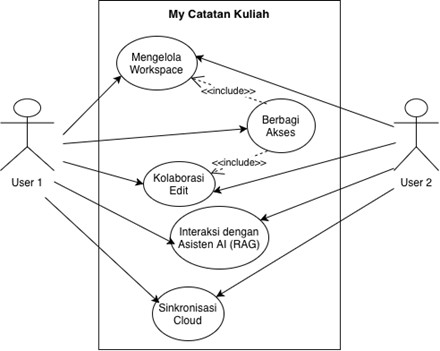
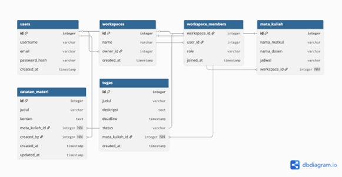
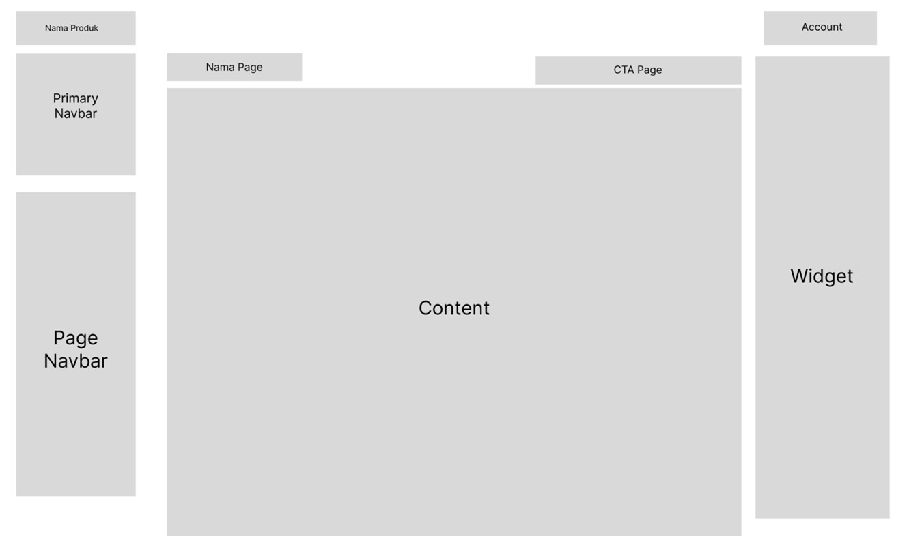
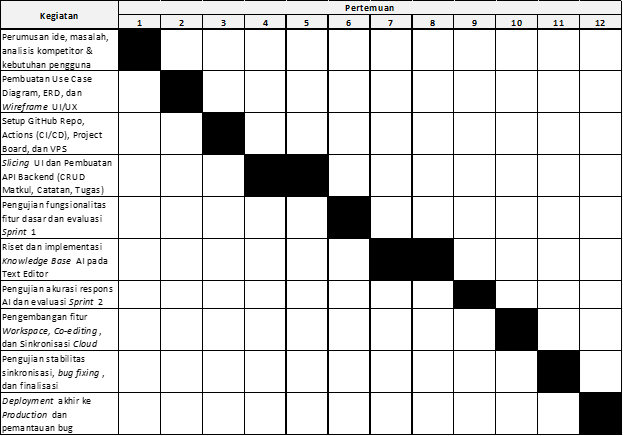

## **Modul 2**

[kembali ke halaman utama](./)

### **Metodologi SDLC**

#### **Metodologi yang digunakan:**

Scrum

#### **Alasan pemilihan metodologi:**

* Rilis Fungsional Cepat secara Bertahap (Iteratif).
* Fleksibilitas terhadap Perubahan Kebutuhan.
* Penggunaan Alat Manajemen Proyek yang Selaras.
* Evaluasi Berkelanjutan.

### **Perancangan Tahap 1-3 SDLC**

#### **a. Tujuan dari produk**

My Catatan Kuliah adalah membantu mahasiswa untuk belajar dan mengelola aktivitas akademik secara lebih efektif, efisien, dan terstruktur.
Secara lebih spesifik, aplikasi ini bertujuan untuk:

* Mengintegrasikan pencatatan materi, manajemen tugas, dan pengaturan jadwal dalam satu platform yang terpusat dan mudah digunakan.
* Menghadirkan pengalaman belajar cerdas melalui Asisten Akademik Berbasis AI. Dengan implementasi Live RAG pada editor, aplikasi bertujuan agar mahasiswa bisa langsung mendapatkan konteks tambahan, penjelasan, atau ringkasan secara real-time saat sedang mencatat, tanpa perlu berpindah aplikasi.
* Meningkatkan produktivitas dengan antarmuka yang intuitif.

#### **b. Pengguna potensial dari produk dan kebutuhan para pengguna tersebut**

Target utama pengguna adalah Mahasiswa yang memiliki beban materi kuliah yang banyak dan membutuhkan alat bantu (seperti Asisten AI) untuk menyederhanakan proses belajar, dan belajar dari catatannya sendiri dengan mudah.
Kebutuhan Para Pengguna:

* **Kebutuhan Bantuan Cerdas (AI & Referensi Cepat):** Saat mencatat, mahasiswa sering membutuhkan referensi tambahan atau penjelasan instan terkait istilah yang sulit. Mereka membutuhkan asisten AI (Live RAG) terintegrasi yang bisa mencari informasi kontekstual langsung di dalam lembar catatan.
* **Kebutuhan Integrasi & kolaborasi:** Mahasiswa membutuhkan satu platform terpusat agar catatan dan tugas tidak terpisah-pisah dan bisa berkolaborasi secara realtime.
* **Kebutuhan Kesederhanaan (Intuitif):** Mahasiswa membutuhkan aplikasi yang langsung siap digunakan tanpa setup yang rumit.
* **Kebutuhan Manajemen Materi & Tugas:** Mahasiswa membutuhkan pengingat tenggat waktu (deadline) dan struktur catatan berbasis mata kuliah.

#### **c. Use case diagram**

#### **d. Functional requirements untuk use case yang telah dirancang**

| FR | Deskripsi |
| ------ | ------ |
| FR 1 - Register | User harus bisa membuat akun baru. |
| FR 2 - Login | User harus bisa login ke dalam aplikasi. |
| FR 3 - CRUD Mata Kuliah | User harus bisa menambah, melihat, mengubah, dan menghapus data mata kuliah beserta detail dosen dan jadwal. |
| FR 4 - CRUD Catatan Materi | User harus bisa membuat, membaca, mengedit, dan menghapus catatan materi perkuliahan pada text editor. |
| FR 5 - CRUD Tugas | User harus bisa mencatat tugas baru, mengatur tenggat waktu (deadline), menghapus, dan menandai tugas yang sudah selesai. |
| FR 6 - Dashboard Progres | Konten dashboard harus tampil untuk memvisualisasikan perkembangan penyelesaian tugas dan aktivitas belajar. |
| FR 7 - Manage Workspace | User (Host) harus bisa membuat dan mengelola workspace kolaborasi, serta membagikan akses (invite) kepada user lain. |
| FR 8 - Kolaborasi Catatan | User (Host) dan User lain (Kolaborator) harus bisa melakukan co-editing pada catatan dan tugas yang sama. |
| FR 9 - Interaksi AI (Live RAG) | User harus bisa memanggil dan berinteraksi dengan Asisten AI di dalam editor catatan untuk mencari referensi atau merangkum teks. |
| FR 10 - Cloud Sync | Sistem harus bisa menyimpan dan menyinkronkan seluruh data (catatan, tugas, akun) ke cloud secara otomatis. |

#### **e. Entity Relationship Diagram**

#### **f. Low-Fidelity Wireframe**

#### **g. Gantt-Chart pengerjaan proyek dalam kurun waktu 1 semester**

